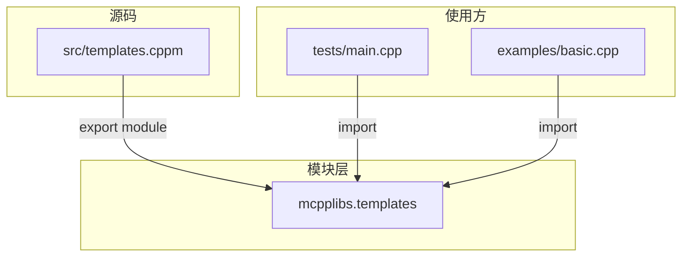
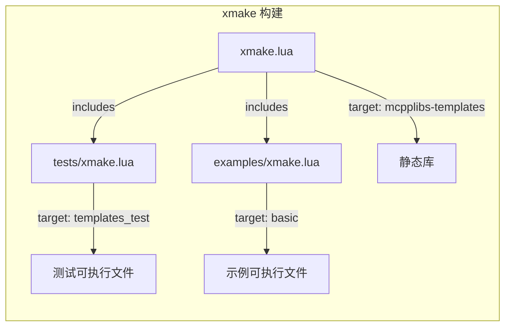
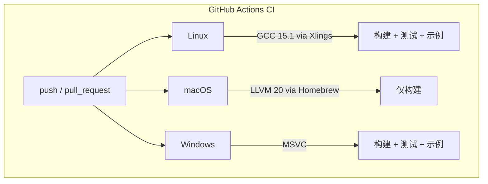

# 架构文档

> mcpplibs/templates 项目架构与设计说明

## 概述

`mcpplibs/templates` 是 mcpplibs 生态中的标准化 C++23 模块库项目模板。它提供了一套完整的项目骨架，包含模块源码、测试、示例、构建配置和 CI/CD 流水线，帮助开发者快速创建符合 [mcpp-style-ref](https://github.com/mcpp-community/mcpp-style-ref) 编码规范的模块化 C++ 库。

## 目录结构

```
mcpplibs-templates/
├── src/                        # 模块源码目录
│   └── templates.cppm          # 主模块接口文件
├── tests/                      # 测试目录
│   ├── main.cpp                # 测试入口
│   └── xmake.lua               # 测试构建配置
├── examples/                   # 示例目录
│   ├── basic.cpp               # 基础用法示例
│   └── xmake.lua               # 示例构建配置
├── docs/                       # 文档目录
│   └── architecture.md         # 架构文档（本文件）
├── .github/workflows/          # CI/CD 配置
│   └── ci.yml                  # GitHub Actions 流水线
├── xmake.lua                   # xmake 构建配置（主配置）
├── CMakeLists.txt              # CMake 构建配置
├── config.xlings               # xlings 工具链配置
├── .gitignore                  # Git 忽略规则
├── .gitattributes              # Git 属性（.cppm 语言识别）
├── LICENSE                     # Apache-2.0 许可证
└── README.md                   # 项目说明
```

## 模块架构

### 模块结构



### 模块命名规范

遵循 [mcpp-style-ref 2.4 模块命名规范](https://github.com/mcpp-community/mcpp-style-ref#24-%E6%A8%A1%E5%9D%97%E5%8F%8A%E6%A8%A1%E5%9D%97%E5%88%86%E5%8C%BA%E5%91%BD%E5%90%8D%E8%A7%84%E8%8C%83)：

- **模块名格式**: `组织.库名` — 例: `mcpplibs.templates`
- **模块分区**: `组织.库名:分区名` — 例: `mcpplibs.templates:utils`
- **命名空间**: 与模块名对应 — 例: `mcpplibs::templates`

### 模块文件结构

每个 `.cppm` 文件遵循以下结构：

```cpp
module;                             // 全局模块片段（可选，用于传统头文件）

export module mcpplibs.templates;   // 模块声明

import std;                         // 模块导入区域

namespace mcpplibs::templates {     // 接口导出与实现

    export void hello_mcpp() {
        std::println("hello mcpp!");
    }

}
```

### 扩展模块分区

当库规模增长时，可按照 [mcpp-style-ref 2.5](https://github.com/mcpp-community/mcpp-style-ref#25-%E5%A4%9A%E6%96%87%E4%BB%B6%E6%A8%A1%E5%9D%97%E5%92%8C%E7%9B%AE%E5%BD%95) 的模式拆分为多个模块分区：

```
src/
├── templates.cppm              # 主模块，export import 各分区
├── templates/
│   ├── core.cppm               # export module mcpplibs.templates:core
│   └── utils.cppm              # export module mcpplibs.templates:utils
```

主模块文件中聚合导出：

```cpp
export module mcpplibs.templates;

export import :core;
export import :utils;
```

## 编码规范

遵循 [mcpp-style-ref](https://github.com/mcpp-community/mcpp-style-ref) 编码规范：

| 类别 | 风格 | 示例 |
|------|------|------|
| 类型名 | PascalCase（大驼峰） | `StyleRef`, `HttpServer` |
| 对象/数据成员 | camelCase（小驼峰） | `fileName`, `configText` |
| 函数 | snake_case（下划线） | `load_config()`, `parse_()` |
| 私有成员 | `_` 后缀 | `data_`, `parse_()` |
| 命名空间 | 全小写 | `mcpplibs`, `mcpplibs::templates` |
| 全局变量 | `g` 前缀 | `gStyleRef` |

## 构建系统

### 构建流程



### xmake

主构建配置 `xmake.lua` 定义静态库 target，并通过 `includes` 引入子目录的构建配置：

```lua
add_rules("mode.release", "mode.debug")
set_languages("c++23")

target("mcpplibs-templates")
    set_kind("static")
    add_files("src/*.cppm", { public = true, install = true })
    set_policy("build.c++.modules", true)

includes("examples", "tests")
```

关键配置说明：
- `set_languages("c++23")` — 启用 C++23 标准
- `add_files("src/*.cppm", { public = true, install = true })` — 通配模块源文件，支持自动发现新增分区
- `set_policy("build.c++.modules", true)` — 启用 C++20/23 模块支持
- `includes("examples", "tests")` — 引入子目录构建配置，保持主文件简洁

### CMake

`CMakeLists.txt` 提供对 CMake 4.0+ 的支持，使用实验性 `import std` 功能：

```cmake
cmake_minimum_required(VERSION 4.0.2)
set(CMAKE_EXPERIMENTAL_CXX_IMPORT_STD "a9e1cf81-9932-4810-974b-6eccaf14e457")
set(CMAKE_CXX_STANDARD 23)
set(CMAKE_CXX_MODULE_STD 1)
```

### 工具链配置

`config.xlings` 定义项目所需的工具链版本：

```lua
xname = "mcpplibs-templates"

xim = {
    xmake = "3.0.4",
    cmake = "4.0.2",
    ninja = "1.12.1",
    cpp = "",           -- gcc15 或 mingw13
}
```

通过 `xlings install` 可一键安装所有依赖工具。

## CI/CD 流水线

### 多平台构建矩阵



| 平台 | 编译器 | 构建 | 测试 | 示例 |
|------|--------|------|------|------|
| Linux (Ubuntu) | GCC 15.1 | Y | Y | Y |
| macOS | LLVM 20 | Y | - | - |
| Windows | MSVC | Y | Y | Y |

macOS 当前仅构建不运行测试和示例，因为部分模块特性在 Clang/LLVM 上的支持仍在完善中。

## 如何基于模板创建新库

1. **克隆模板**

```bash
git clone https://github.com/mcpplibs/templates.git mcpplibs-mylib
cd mcpplibs-mylib
rm -rf .git && git init
```

2. **重命名模块**

将 `templates` 替换为你的库名（例如 `mylib`）：

- `src/templates.cppm` → 修改 `export module mcpplibs.mylib;`
- `xmake.lua` → 修改 target 名称为 `mcpplibs-mylib`
- `CMakeLists.txt` → 修改 project 和 target 名称
- `config.xlings` → 修改 `xname`

3. **添加模块分区**（按需）

在 `src/` 下创建新的 `.cppm` 文件，xmake 会通过通配符 `src/*.cppm` 自动发现。

4. **编写测试和示例**

在 `tests/` 和 `examples/` 下添加对应的源文件和 xmake target。

5. **推送并验证 CI**

```bash
git add .
git commit -m "init: mcpplibs-mylib"
git remote add origin https://github.com/mcpplibs/mylib.git
git push -u origin main
```

## 参考

- [mcpp-style-ref | 现代C++编码/项目风格参考](https://github.com/mcpp-community/mcpp-style-ref)
- [mcpplibs/cmdline | 命令行解析库（参考项目）](https://github.com/mcpplibs/cmdline)
- [mcpp社区官网](https://mcpp.d2learn.org)
